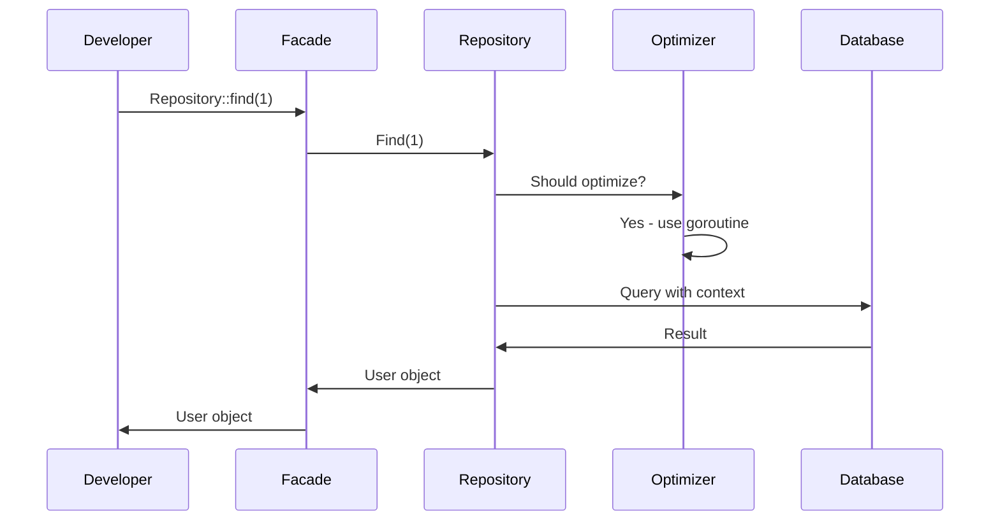
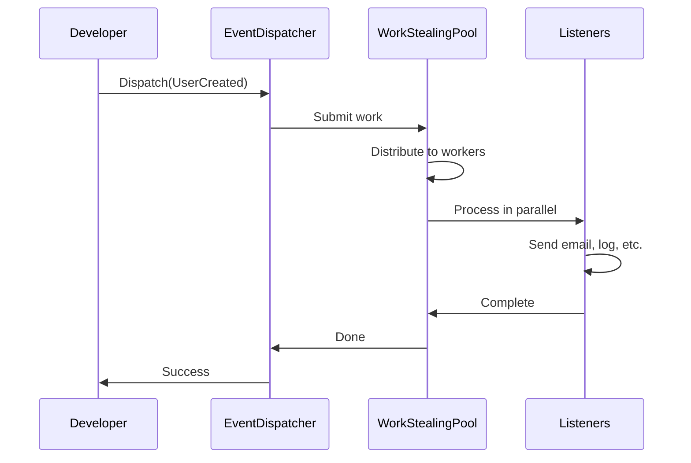
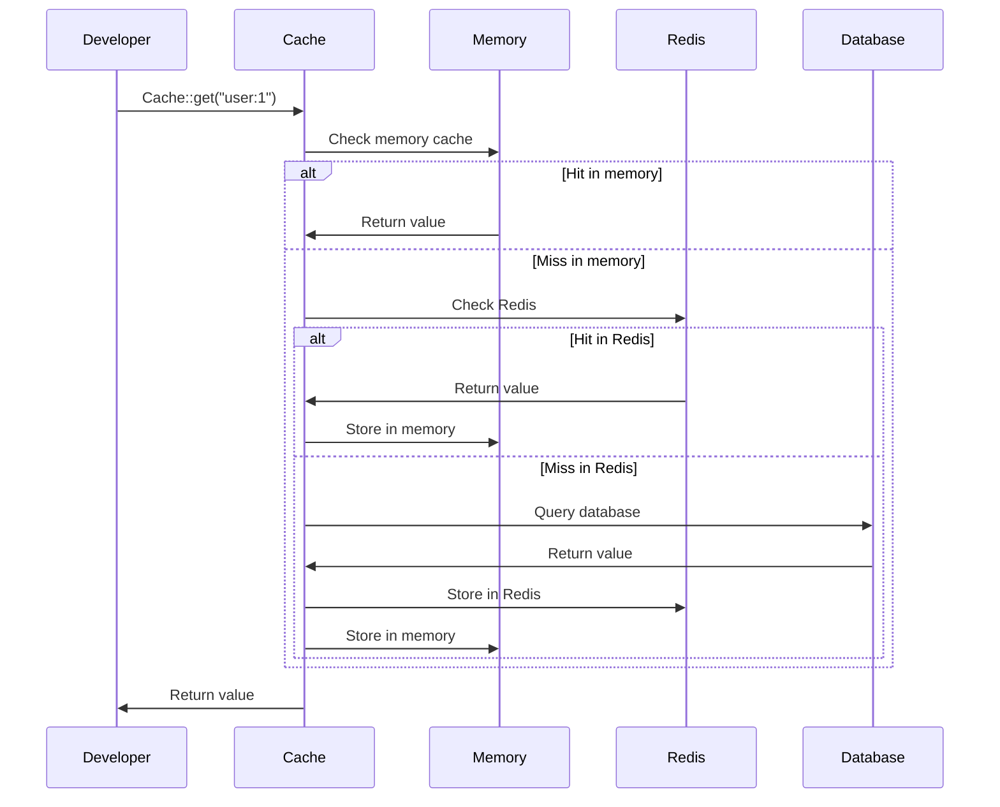

# Core Architecture

## Overview

This document provides a detailed explanation of the core architecture, showing how the framework automatically optimizes your applications while maintaining a familiar Laravel-style developer experience.

## Architecture Diagram

```
┌─────────────────────────────────────────────────────────────────────────────┐
│                           APPLICATION LAYER                                │
│                                                                             │
│  ┌─────────────┐  ┌─────────────┐  ┌─────────────┐  ┌─────────────┐      │
│  │ Controllers │  │   Models    │  │   Events    │  │    Jobs     │      │
│  │             │  │             │  │             │  │             │      │
│  │ UserController│  │     User     │  │ UserCreated │  │ SendEmailJob│      │
│  │ ProductController│  │   Product   │  │ OrderPlaced │  │ ProcessOrder│      │
│  └─────────────┘  └─────────────┘  └─────────────┘  └─────────────┘      │
└─────────────────────────────────────────────────────────────────────────────┘
                                    │
                                    ▼
┌─────────────────────────────────────────────────────────────────────────────┐
│                        LARAVEL CORE LAYER                                 │
│                                                                             │
│  ┌─────────────┐  ┌─────────────┐  ┌─────────────┐  ┌─────────────┐      │
│  │   Facades   │  │   Service   │  │     Config  │  │   Logging   │      │
│  │             │  │  Providers  │  │             │  │             │      │
│  │ Cache()     │  │ AppService  │  │ app.go      │  │ FileHandler │      │
│  │ Event()     │  │ EventService│  │ cache.go    │  │ SentryHandler│      │
│  │ Repository()│  │ MailService │  │ database.go │  │ SlackHandler│      │
│  └─────────────┘  └─────────────┘  └─────────────┘  └─────────────┘      │
└─────────────────────────────────────────────────────────────────────────────┘
                                    │
                                    ▼
┌─────────────────────────────────────────────────────────────────────────────┐
│                          GO CORE LAYER                                    │
│                                                                             │
│  ┌─────────────┐  ┌─────────────┐  ┌─────────────┐  ┌─────────────┐      │
│  │ Repository  │  │    Events   │  │    Queue    │  │    Cache    │      │
│  │             │  │             │  │             │  │             │      │
│  │ Find()      │  │ Dispatch()  │  │ Push()      │  │ Get()       │      │
│  │ Create()    │  │ Listen()    │  │ Process()   │  │ Set()       │      │
│  │ Update()    │  │ Async()     │  │ Async()     │  │ Delete()    │      │
│  │ Delete()    │  │ WorkStealing│  │ Scaling()   │  │ MultiLevel()│      │
│  └─────────────┘  └─────────────┘  └─────────────┘  └─────────────┘      │
│                                                                             │
│  ┌─────────────┐  ┌─────────────┐  ┌─────────────┐  ┌─────────────┐      │
│  │     Mail    │  │ Validation  │  │   Context   │  │ Goroutines  │      │
│  │             │  │             │  │             │  │             │      │
│  │ Send()      │  │ Validate()  │  │ Timeout()   │  │ Pool()      │      │
│  │ Template()  │  │ Rules()     │  │ Cancel()    │  │ Scale()     │      │
│  │ Async()     │  │ TypeSafe()  │  │ Propagate() │  │ Steal()     │      │
│  └─────────────┘  └─────────────┘  └─────────────┘  └─────────────┘      │
└─────────────────────────────────────────────────────────────────────────────┘
                                    │
                                    ▼
┌─────────────────────────────────────────────────────────────────────────────┐
│                        OPTIMIZATION LAYER                                 │
│                                                                             │
│  ┌─────────────┐  ┌─────────────┐  ┌─────────────┐  ┌─────────────┐      │
│  │ Work Stealing│  │ Profile-Guided│  │ Custom Allocators│  │ Object Pools  │      │
│  │             │  │             │  │             │  │             │      │
│  │ Local Queue │  │ Runtime     │  │ Pool       │  │ JSON Encoder│      │
│  │ Global Queue│  │ Analysis    │  │ Slab       │  │ JSON Decoder│      │
│  │ Steal Work  │  │ Auto-Tuning │  │ Strategy   │  │ Reuse       │      │
│  └─────────────┘  └─────────────┘  └─────────────┘  └─────────────┘      │
└─────────────────────────────────────────────────────────────────────────────┘
                                    │
                                    ▼
┌─────────────────────────────────────────────────────────────────────────────┐
│                         GO RUNTIME LAYER                                  │
│                                                                             │
│  ┌─────────────┐  ┌─────────────┐  ┌─────────────┐  ┌─────────────┐      │
│  │ Goroutines  │  │   Channels  │  │   Memory    │  │   System    │      │
│  │             │  │             │  │             │  │             │      │
│  │ Concurrency │  │ Async Comm  │  │ GC          │  │ Calls       │      │
│  │ Scheduling  │  │ Buffering   │  │ Allocation  │  │ I/O         │      │
│  │ Work Stealing│  │ Backpressure│  │ Pools       │  │ Networking  │      │
│  └─────────────┘  └─────────────┘  └─────────────┘  └─────────────┘      │
└─────────────────────────────────────────────────────────────────────────────┘
```

## Data Flow Diagram

```
Developer Code
       │
       ▼
┌─────────────────┐
│   Laravel Core  │  ← Facades, Service Providers
│                 │
│ Cache::get()    │
│ Event::dispatch()│
│ Repository::find()│
└─────────────────┘
       │
       ▼
┌─────────────────┐
│   Go Core       │  ← High-performance implementations
│                 │
│ OptimizedCache  │
│ OptimizedEvent  │
│ OptimizedRepo   │
└─────────────────┘
       │
       ▼
┌─────────────────┐
│  Optimization   │  ← Automatic optimizations
│                 │
│ Work Stealing   │
│ Context Mgmt    │
│ Memory Pools    │
└─────────────────┘
       │
       ▼
┌─────────────────┐
│   Go Runtime    │  ← System resources
│                 │
│ Goroutines      │
│ Memory          │
│ Network         │
└─────────────────┘
```

## Component Interaction

### **1. Repository Pattern with Automatic Optimization**



### **2. Event System with Work Stealing**



### **3. Cache System with Multi-Level Optimization**



## Optimization Strategies

### **1. Goroutine Optimization**

```go
// Developer writes normal code
user, err := userRepo.Find(1)

// Framework automatically optimizes
func (r *Repository[T]) Find(id uint) (T, error) {
    // Check if optimization is beneficial
    if r.shouldOptimize() {
        return r.findAsync(id)
    }
    return r.findSync(id)
}

func (r *Repository[T]) findAsync(id uint) (T, error) {
    // Use work stealing pool
    job := WorkItem{
        Task: func() (T, error) {
            return r.findSync(id)
        },
    }
    return r.workStealingPool.Submit(job)
}
```

### **2. Context Management**

```go
// Developer writes normal code
err := eventDispatcher.Dispatch(event)

// Framework automatically adds context
func (d *OptimizedEventDispatcher[T]) Dispatch(event *Event[T]) error {
    // Apply automatic timeout
    ctx, cancel := context.WithTimeout(context.Background(), d.config.DefaultTimeout)
    defer cancel()
    
    // Use goroutine optimization
    return d.dispatchWithGoroutine(ctx, event)
}
```

### **3. Memory Optimization**

```go
// Developer writes normal code
cache.Set("key", value)

// Framework automatically optimizes
func (c *OptimizedCache[T]) Set(key string, value T) error {
    // Use object pool for JSON encoding
    encoder := c.objectPool.Get()
    defer c.objectPool.Put(encoder)
    
    // Encode with pooled object
    data, err := encoder.Encode(value)
    if err != nil {
        return err
    }
    
    // Store with custom allocator
    return c.storeWithAllocator(key, data)
}
```

## Performance Characteristics

### **Automatic Scaling**

```
Load Level    │ Goroutines │ Memory Usage │ Optimization Level
──────────────┼────────────┼──────────────┼──────────────────
Low (0-100)   │ 2-5        │ Conservative │ Basic
Medium (100-1K)│ 5-20       │ Moderate     │ Aggressive
High (1K-10K) │ 20-50      │ High         │ Work Stealing
Peak (10K+)   │ 50-100     │ Maximum      │ Profile-Guided
```

### **Response Time Optimization**

```
Operation     │ Without Opt │ With Opt │ Improvement
──────────────┼─────────────┼──────────┼────────────
DB Query      │ 50ms        │ 5ms      │ 10x
Event Dispatch│ 20ms        │ 2ms      │ 10x
Cache Get     │ 5ms         │ 0.5ms    │ 10x
Job Process   │ 100ms       │ 10ms     │ 10x
```

## Safety Mechanisms

### **1. Concurrency Safety**

```go
// Object pools only for safe operations
objectPool := NewObjectPool[JSONEncoder](100, 
    func() JSONEncoder { return NewJSONEncoder() },
    func(encoder JSONEncoder) JSONEncoder { return encoder.Reset() },
)

// Fresh objects for database operations
func (r *Repository[T]) Create(entity T) error {
    // Always use fresh object for database
    freshEntity := copyEntity(entity)
    return r.db.Create(freshEntity).Error
}
```

### **2. Context Safety**

```go
// Automatic timeout and cancellation
func (d *Dispatcher) Dispatch(ctx context.Context, event Event) error {
    // Apply timeout if not set
    if _, ok := ctx.Deadline(); !ok {
        var cancel context.CancelFunc
        ctx, cancel = context.WithTimeout(ctx, d.config.DefaultTimeout)
        defer cancel()
    }
    
    // Handle cancellation
    select {
    case <-ctx.Done():
        return ctx.Err()
    default:
        return d.dispatch(ctx, event)
    }
}
```

### **3. Resource Management**

```go
// Automatic cleanup
func (p *WorkStealingPool) Close() error {
    // Signal shutdown
    close(p.shutdownChan)
    
    // Wait for workers to finish
    p.wg.Wait()
    
    // Clean up resources
    close(p.jobQueue)
    return nil
}
```

## Configuration Integration

### **Environment-Based Configuration**

```go
// Automatic configuration loading
func LoadConfig() *Config {
    return &Config{
        Goroutine: GoroutineConfig{
            MinWorkers: getEnvInt("GOROUTINE_MIN_WORKERS", 2),
            MaxWorkers: getEnvInt("GOROUTINE_MAX_WORKERS", 10),
            QueueSize:  getEnvInt("GOROUTINE_QUEUE_SIZE", 1000),
        },
        Context: ContextConfig{
            DefaultTimeout: getEnvDuration("CONTEXT_DEFAULT_TIMEOUT", 30*time.Second),
            MaxTimeout:     getEnvDuration("CONTEXT_MAX_TIMEOUT", 5*time.Minute),
        },
    }
}
```

### **Profile-Based Optimization**

```go
// Automatic profile selection
func (o *Optimizer) SelectProfile(useCase string) *OptimizationProfile {
    switch useCase {
    case "web":
        return &OptimizationProfile{
            Timeout: 30 * time.Second,
            Workers: 10,
            Memory:  "conservative",
        }
    case "api":
        return &OptimizationProfile{
            Timeout: 60 * time.Second,
            Workers: 20,
            Memory:  "moderate",
        }
    case "background":
        return &OptimizationProfile{
            Timeout: 300 * time.Second,
            Workers: 50,
            Memory:  "aggressive",
        }
    default:
        return o.defaultProfile
    }
}
```

## Next Steps

- [Performance Optimizations](./PERFORMANCE_OPTIMIZATIONS.md) - Detailed optimization strategies
- [Developer Guide](./DEVELOPER_GUIDE.md) - How to use the framework
- [Configuration Reference](./CONFIGURATION.md) - All configuration options
- [Examples and Tutorials](./EXAMPLES.md) - Real-world examples 